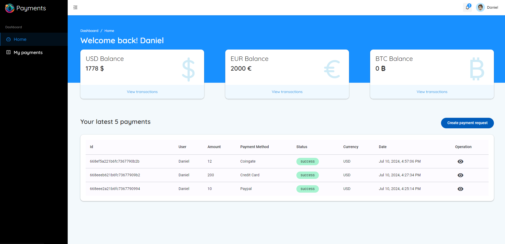

# Payment test app



## Features backend

- ⚡️ NestJs version 10 (last version)

- 💾 MongoDb database integration with Mongoose 

- 🛒 Nest Bull for manage queues

- 💥 Redis integration 

- 💳 Passport authentication

## Features Frontend

- ⚡️ Angular version 18 (last version)

- 💾 Custom stores using signals 

- 🎨 Angular Material components customized

- 💅🏻 Custom layout design

- ⌛ Real time integration using socket.io integration for Angular


## Preview

- [Demo](https://payment-app.vercel.app)

#### Download

- [Download from GitHub](https://github.com/MrDeivi/payment_app_test)

## Try it now!

> Requires Node >=20.0.0

### Clone to local

```bash
git clone https://github.com/MrDeivi/payment_app_test

cd payment_app_test

pnpm i # If you don't have pnpm installed, run: npm install -g pnpm

```

## Checklist


Frontend Requirements (Angular)

1. Project configuration:
   - ✅ Create an application using the latest stable version of Angular.
   - ✅ Use scss for style definition.
   - ✅ Incorporates @angular/material to use components as needed in the development of the required views.

2. Authentication:
   - ✅ Implements authentication using the mechanism implemented in the API.
   - ✅ Store the token locally so that it persists in case of application reloads.
   - ✅ Implement user roles and role-based path protections.
   - ✅ If the token expires the webapp must respond appropriately.

3. Components and Routing. Create components for:
   - ✅ User registration.
   - ✅ Login.
   - ✅ User dashboard with payment requests.
   - ✅ Administrator dashboard to manage payment requests.
   - ✅ View with details of a payment request.
   - ✅ Creation of payment requests.
   - ✅ Protects application paths so that only authenticated users with appropriate permissions can access certain views.
   - ✅ Ensure that code in sections that are not accessed is never loaded.

4. User Interface:
   - ✅ Use Angular Material for interface design.
   - ✅ Make sure the interface is responsive and easy to use.
   - ✅ Use some mechanism to manage the state of the application so that it is easily accessible from the whole application. 
 
And, enjoy :)

## Usage

### Development

Just run and visit http://localhost:4200

```bash
pnpm start
```

### Build

To build the App, run

```bash
pnpm build
```

And you will see the generated file in `dist` that ready to be served.
